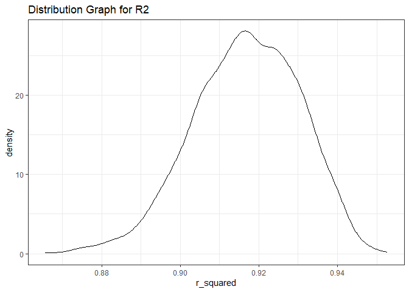
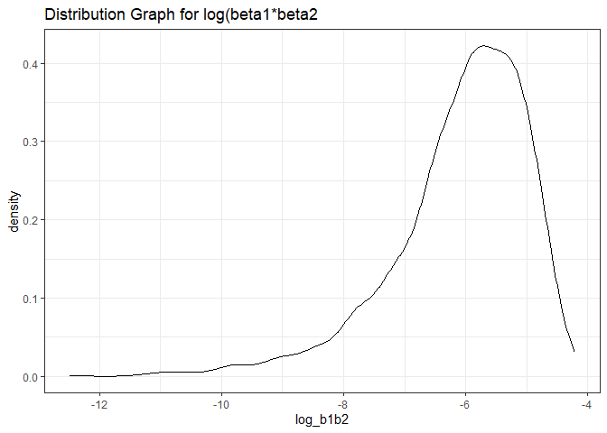

p8105_hw6_bp2678
================
Brady Pham
2023-11-30

``` r
library(tidyverse)
```

    ## ── Attaching core tidyverse packages ──────────────────────── tidyverse 2.0.0 ──
    ## ✔ dplyr     1.1.3     ✔ readr     2.1.4
    ## ✔ forcats   1.0.0     ✔ stringr   1.5.0
    ## ✔ ggplot2   3.4.3     ✔ tibble    3.2.1
    ## ✔ lubridate 1.9.2     ✔ tidyr     1.3.0
    ## ✔ purrr     1.0.2     
    ## ── Conflicts ────────────────────────────────────────── tidyverse_conflicts() ──
    ## ✖ dplyr::filter() masks stats::filter()
    ## ✖ dplyr::lag()    masks stats::lag()
    ## ℹ Use the conflicted package (<http://conflicted.r-lib.org/>) to force all conflicts to become errors

``` r
library(dplyr)
library(ggplot2)
library(rvest)
```

    ## 
    ## Attaching package: 'rvest'
    ## 
    ## The following object is masked from 'package:readr':
    ## 
    ##     guess_encoding

``` r
library(broom)
library(purrr)
library(p8105.datasets)
set.seed(1)
```

\#Question 2

``` r
weather_df = 
  rnoaa::meteo_pull_monitors(
    c("USW00094728"),
    var = c("PRCP", "TMIN", "TMAX"), 
    date_min = "2022-01-01",
    date_max = "2022-12-31") |>
  mutate(
    name = recode(id, USW00094728 = "CentralPark_NY"),
    tmin = tmin / 10,
    tmax = tmax / 10) |>
  select(name, id, everything())
```

    ## Registered S3 method overwritten by 'hoardr':
    ##   method           from
    ##   print.cache_info httr

    ## using cached file: C:\Users\bradf\AppData\Local/R/cache/R/rnoaa/noaa_ghcnd/USW00094728.dly

    ## date created (size, mb): 2023-10-09 11:57:58.716969 (0.344)

    ## file min/max dates: 2021-01-01 / 2023-10-31

\#Boot strapped the data and cleaned it

``` r
boot_strap_results = 
  weather_df |> 
  modelr::bootstrap(n = 5000) |> 
  mutate(
    models = map(strap, ~lm(tmax ~ tmin +prcp, data = .x)),
    results_log = map(models, broom::tidy),
    results_r2 = map(models, broom::glance)
    ) |> 
    unnest(results_log) |> 
     janitor::clean_names() |> 
    select(id:estimate, results_r2) |> 
    pivot_wider(
      names_from = term,
      values_from = estimate
    ) |> 
    mutate(log_b1b2 = log(tmin * prcp)) |> 
 unnest(results_r2) |> 
  janitor::clean_names() |> 
  select(id, r_squared, tmin, prcp, log_b1b2)
```

    ## Warning: There was 1 warning in `mutate()`.
    ## ℹ In argument: `log_b1b2 = log(tmin * prcp)`.
    ## Caused by warning in `log()`:
    ## ! NaNs produced

\#Graph for the r2

``` r
  boot_strap_results |> 
  ggplot(aes(x = r_squared)) + 
  geom_density() +
  labs(title = "Distribution Graph for R2")
```

<!-- --> In
the r2 graph it seems to be a normally distributed graph

\#Graph for the log(b1\*b2)

``` r
  boot_strap_results |> 
  ggplot(aes(x = log_b1b2)) + 
  geom_density() +
  labs(title = "Distribution Graph for log(beta1*beta2")
```

    ## Warning: Removed 3361 rows containing non-finite values (`stat_density()`).

<!-- --> In
the the log(b1\*b2) graph it seems to be left skewd this may be due to
some of the data being missing since the negative values were not
accounted for.

``` r
boot_strap_results |> 
  summarize(
    ci_lower = quantile(r_squared, 0.025), 
    ci_upper = quantile(r_squared, 0.975))
```

    ## # A tibble: 1 × 2
    ##   ci_lower ci_upper
    ##      <dbl>    <dbl>
    ## 1    0.889    0.941

The confidence interval for r squared is (.889, .941)

``` r
boot_strap_results |> 
  summarize(
    ci_lower = quantile(log_b1b2, 0.025, na.rm = TRUE), 
    ci_upper = quantile(log_b1b2, 0.975, na.rm = TRUE))
```

    ## # A tibble: 1 × 2
    ##   ci_lower ci_upper
    ##      <dbl>    <dbl>
    ## 1    -8.98    -4.60

The confidence interval for log(beta1\*beta2) is (-8.96, -4.60)
